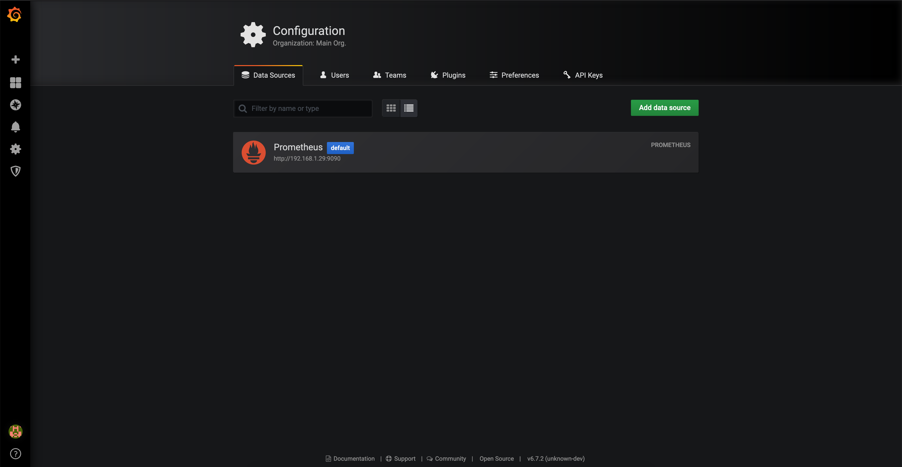
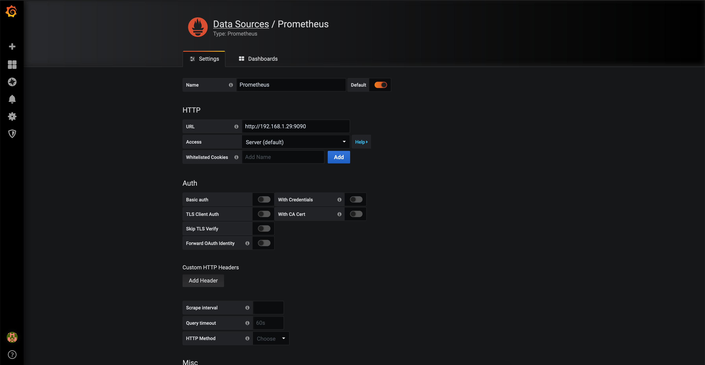
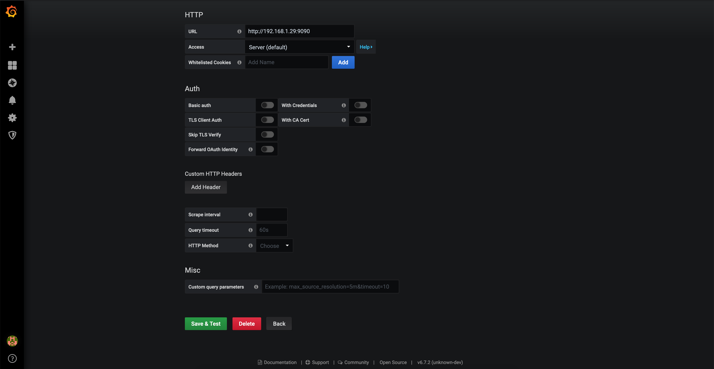
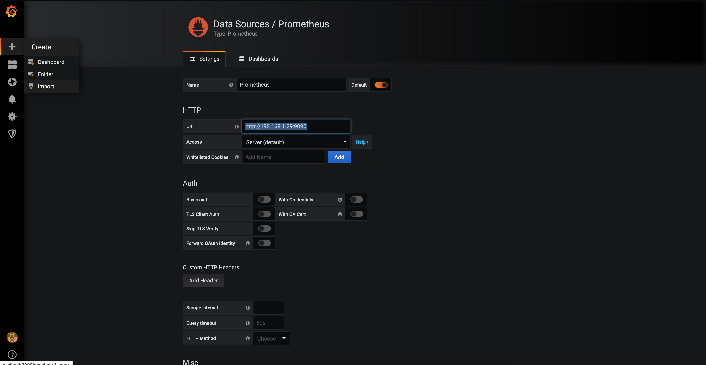

# network-tester

monitors our subpar network connection(s) up in the middle of the woods


## deployment
todo

## running locally
### [on mac](#on-mac):
get set up
```
./setup.sh
```

grafana can be accessed in a browser at [localhost:3000](http://localhost:3000). default login is `admin`/`admin`; change at your leisure.

add data source


put in `http://prometheus:9090` as the url (we configured prometheus to run on that port in the [setup script](https://github.com/DavidsFam/network-tester/blob/master/setup.sh#L15))


save and test


and then import the dashboard


run network tester
```
python3 main.py
```

### on non-mac:
1. buy a mac
2. see [on mac](#on-mac)

### dependencies
this repo depends on
- the python packages in [requirements.txt](requirements.txt)
- the [speedtest CLI](https://www.speedtest.net/apps/cli)
- the OSX command-line networking utility [networksetup](https://www.unix.com/man-page/OSX/8/networksetup/)
- [grafana](https://grafana.com/)
- [prometheus](https://prometheus.io/)
